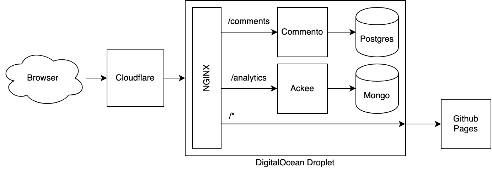

# Personal Site

[Personal Site](https://brandonstilson.com)

I wanted to self-host comment and analytics services using privacy-focused, OSS tools, but also have Github host the actual content. I use [Envoy](https://www.envoyproxy.io) as a reverse-proxy to send traffic accordingly:

Everything is hosted on a single Digital Ocean Droplet in a single Docker Compose network at the moment.

For analytics, I chose [Ackee](https://ackee.electerious.com/).

Built on the [reverie theme](https://www.amitmerchant.com/reverie/).
